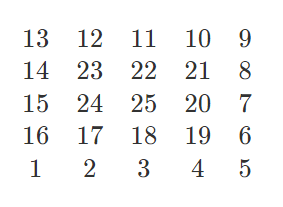
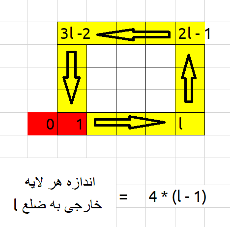

# باشگاه برنامه نویسان
**سلام بچه ها. این جا قراره محلی برای تمرین کسانی باشه که از قبل مقدمات و اصول کلی برنامه نویسی رو به یک زبان بلد هستند. هدفمون اینه که سوال های چالشی رو با الگوریتم ها و زبان های مختلف حل کنیم، از همدیگه یاد بگیریم و مهارتمون رو بیشتر کنیم.**
## 1401-02-28
### رده‌بندی استاید
سوال در کوئرا:
[link](https://quera.org/problemset/181333/)

پوشه جواب ها:
[link](https://github.com/arashnm80/programmers-club/tree/main/dates/1401-02-28)

توضیح: جواب های سری 1 با یک الگوریتیم یکسان به زبان سی پلاس پلاس و پایتون نوشته شدده اند و درست و بهینه هستند. جواب سری 2 هم با پایتونه که ایده اش از حسین انصاری هست، به صورت عمومی درسته اما زمان زیادی رو صرف پردازش میکنه و باعث میشه نتونه تو زمان محدودی که صورت سوال تعریف کرده پردازشش رو انجام بده.

## 1401-02-21
### مربع مارپیچ
سوال در کوئرا:
[link](https://quera.org/contest/assignments/52346/problems/179231)

  

جواب ها با یک الگوریتم یکسان به زبان پایتون و c++ (سری 1 رو خودم تو خونه نوشتم و سری 2 اونیه که سر کلاس با هم نوشتیم):
[link](https://github.com/arashnm80/programmers-club/tree/main/1401-02-21)

نخسه جاوا اسکریپتی اش رو هم حسین انصاری به همون پوشه اضافه کرد.👏

  

